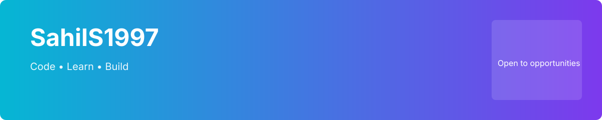

  

# Sahil S — Certified Data Analytics Professional 👋

A seasoned Business Intelligence and Data Analytics expert with a unique background, transitioning from a distinguished career in cricket to becoming a leader in the data realm. I specialize in delivering tailored Data Analytics and Business Intelligence consulting across industries, with additional expertise in Sports Management and Analytics (Cricket).

---

## Core Expertise

- Data Visualization: Impactful, interactive dashboards and reports using Power BI, including Semantic Models and enterprise reporting within Microsoft Fabric.
- Data Engineering: Scalable ETL pipelines using Azure Data Factory and Azure Synapse Analytics; Microsoft Fabric Data Factory, Lakehouse, and Data Warehouse solutions.
- Data Analysis & Process Automation: Python and Power Automate for insights and workflow automation across modern analytics platforms.
- Data Governance & Delivery: Implementation of secure, enterprise-grade data solutions — governance across OneLake, workspace management, access control, and delivery.
- Microsoft Fabric: End-to-end expertise across OneLake, Lakehouse, Data Warehouse, Data Factory, Real-Time Analytics, Dataflows Gen2, Notebooks, Pipelines, and Semantic Models.
- Application Development: Building user-centric solutions using Power Apps.

## Technical Proficiency

- Databases: T-SQL, MySQL, PostgreSQL, MongoDB, Oracle, SAP HANA
- Visualization: Power BI, Google Data Studio, Tableau (Power BI integration within Microsoft Fabric)
- Programming & Automation: Python, VBA (Advanced Excel), Power Automate, Power Query
- Cloud & Analytics: Azure Synapse, Azure Data Factory, Microsoft Fabric, OneLake, Lakehouse, Dataflows Gen2, Notebooks, Pipelines
- Spreadsheets: Advanced Excel (VBA, Power Query), Google Sheets, Zoho Sheets

## Selected Services

- BI & Analytics Consulting: Strategy, architecture, and delivery of enterprise reporting platforms.
- End-to-end Fabric Enablement: Lakehouse, semantic modeling, real-time analytics, and secure data delivery.
- Sports Analytics (Cricket): Performance analysis, metrics design, and analytics pipelines for sports teams and organizations.

---

## Projects & Highlights

- [Example Fabric PoC](https://github.com/SahilS1997/example-fabric-poc) — Semantic model + enterprise reporting flow.
- [Cricket Analytics Pipeline](https://github.com/SahilS1997/cricket-analytics) — ETL + dashboards for match and player analytics.

## GitHub Stats

---

## Contact & Work With Me

- Email: your.email@example.com

- Email: your.email@example.com
- LinkedIn: https://linkedin.com/in/your-profile

<!-- README_UPDATED -->Last updated: 2026-05-31<!-- README_UPDATED_END -->

---

If you'd like, I can:
- Add themed badges (dark/light/neon/pastel).
- Generate live cards (streaks, languages) and a GitHub Action to update README on a schedule.
- Create social banner sizes or animated SVGs for your profile and socials.
+
Tell me which of those you'd like next and I will add them.